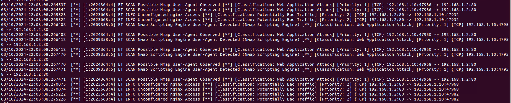

# Домашнее задание к занятию «Защита сети» - Михалёв Сергей

---

### Задание 1

Проведите разведку системы и определите, какие сетевые службы запущены на защищаемой системе:

**sudo nmap -sA < ip-адрес >**

**sudo nmap -sT < ip-адрес >**

**sudo nmap -sS < ip-адрес >**

**sudo nmap -sV < ip-адрес >**

По желанию можете поэкспериментировать с опциями: https://nmap.org/man/ru/man-briefoptions.html.

*В качестве ответа пришлите события, которые попали в логи Suricata и Fail2Ban, прокомментируйте результат.*

**Решение**

- установил и настроил [Suricata](https://www.digitalocean.com/community/tutorials/how-to-install-suricata-on-ubuntu-20-04) 
  
- установил и настроил [Fail2Ban](https://www.digitalocean.com/community/tutorials/how-to-protect-ssh-with-fail2ban-on-ubuntu-22-04) 
  

*sudo nmap -sA 192.168.1.2 *
 
*Priority 3 *

*sudo nmap -sT 192.168.1.2 *
 
*Priority 2 *

*sudo nmap -sS 192.168.1.2 *
 
*Priority 2 *

*sudo nmap -sV 192.168.1.2 *
 
*Priority 2 *

*fail2ban* на сканирования не отреагировал
  
---

### Задание 2

Проведите атаку на подбор пароля для службы SSH:

**hydra -L users.txt -P pass.txt < ip-адрес > ssh**

1. Настройка **hydra**: 
 
 - создайте два файла: **users.txt** и **pass.txt**;
 - в каждой строчке первого файла должны быть имена пользователей, второго — пароли. В нашем случае это могут быть случайные строки, но ради эксперимента можете добавить имя и пароль существующего пользователя.

Дополнительная информация по **hydra**: https://kali.tools/?p=1847.

2. Включение защиты SSH для Fail2Ban:

-  открыть файл /etc/fail2ban/jail.conf,
-  найти секцию **ssh**,
-  установить **enabled**  в **true**.

Дополнительная информация по **Fail2Ban**:https://putty.org.ru/articles/fail2ban-ssh.html.

*В качестве ответа пришлите события, которые попали в логи Suricata и Fail2Ban, прокомментируйте результат.*

**Решение**

С выключенным сервисом *Fail2Ban* сканирование прошло успешно. 
 
*Suricata* зарегистрировала этот факт 

Включил *Fail2Ban* 
 
*Suricata*  

